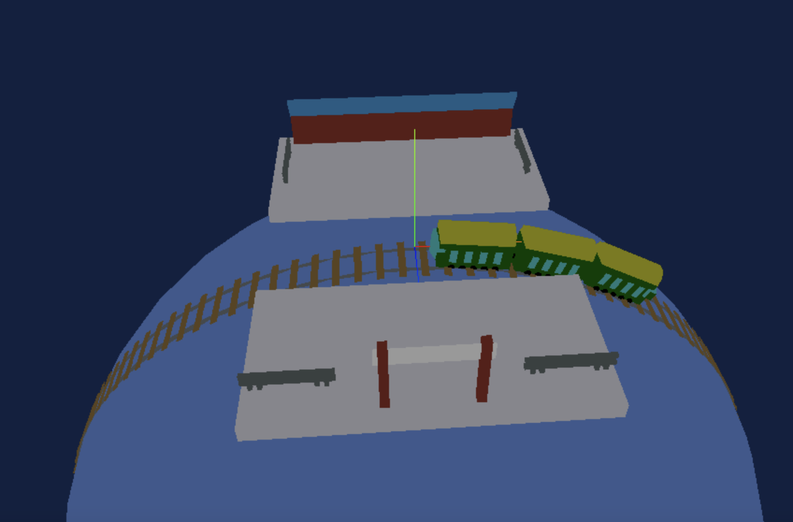

# Station simulation app

## Description
This app is result of application programming subject (応用プログラミング). I simulate a 3d station used Three.js library.

To build this app, i separate this into small part like block of train, rails, station, etc... . After that, i need to calculate exactly position of each part and combine all to together. Finally, To apply animation to the train, i create an equation to calculate train position for each frame, and animate it.

